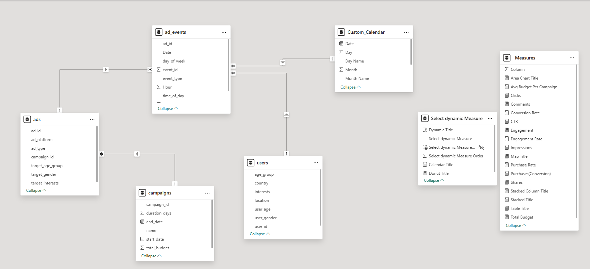

# 📊 Meta Ad Performance Dashboard (Power BI)

[.png)](https://app.powerbi.com/view?r=eyJrIjoiZjBlOGE0ZDYtZDA3Mi00YjVmLTljMTUtZjM5NmFmMjkxNGI4IiwidCI6IjA1ODJiNDQ5LTFhZWEtNGM1ZC05YTE0LTA5NGZlYmI4NGFmNiJ9)

## 🚀 Introduction

This project is a comprehensive Power BI dashboard designed to analyze and visualize the performance of advertising campaigns on Meta platforms (Facebook and Instagram). The dashboard provides a high-level overview of key metrics and allows for deep-dive analysis into audience demographics, ad types, and campaign performance to drive data-driven marketing decisions.

---

## Problem Statement
The goal is to consolidate complex ad performance data into a single, interactive, and easy-to-understand report. This helps marketers and analysts to quickly:
* Track key performance indicators (KPIs) in real-time.
* Understand audience behavior and preferences.
* Identify high and low performing ads and campaigns.
* Optimize ad spend and improve return on investment (ROI).

---

## 🛠️ Technology Stack
* **Power BI Desktop:** Used for data modeling, analysis, and visualization.
* **Power Query:** Used for data cleaning, transformation, and ETL (Extract, Transform, Load).
* **DAX (Data Analysis Expressions):** Used for creating complex measures and calculated columns.

---

## 🗂️ Data Model & Schema

The data model consists of several tables, structured to support comprehensive analysis. The schema is designed in a star schema fashion, with one central fact table (`ad_events`) and multiple dimension tables.

### 1. `ad_events` (Fact Table)
This table contains all the individual event records related to the ads.

| Column Name | Description | Data Type |
| :--- | :--- | :--- |
| `event_id` | Primary key for the event record | Int |
| `ad_id` | Foreign key linking to the `ads` table | Int |
| `user_id` | Foreign key linking to the `users` table |Text |
| `timestamp` | Date And Time Combination | Timestamp|
| `day_of_week` | The day of the week the event occurred | Text |
| `time_of_day` | A category for the time (e.g., Morning, Afternoon, Night) | Text |
| `event_type` | Type of event (e.g., Click, Impression, Share, Comment) | Text |
| `Date` | Foreign key linking to the `Custom_Calendar` table | Date |
| `Hour` | The hour of the day the event occurred (0-23) | Int |

### 2. `ads` (Dimension Table)
This table contains descriptive information about each ad.

| Column Name | Description | Data Type |
| :--- | :--- | :--- |
| `ad_id` | Primary key for the ad | Int |
| `campaign_id` | Foreign key linking to `campaigns` | Int |
| `ad_platform` | Platform where the ad was shown (e.g., Facebook) | Text |
| `ad_type` | Type of ad (e.g., Carousel, Image, Video) | Text |
| `target_gender` | The intended gender demographic for the ad | Text |
| `target_age_group`| The intended age demographic for the ad | Text |
| `target_interests`| The intended interest group for the ad | Text |

### 3. `users` (Dimension Table)
This table contains demographic information about the users who interacted with the ads.

| Column Name | Description | Data Type |
| :--- | :--- | :--- |
| `user_id` | Primary key for the user | Text |
| `user_gender` | The gender of the user | Text |
| `user_age` | The specific age of the user | Int |
| `age_group` | Age range of the user | Text |
| `country` | Country of the user | Text |
| `location` | Specific location of the user | Text |
| `interests` | The user's interests | Text |

### 4. `campaigns` (Dimension Table)
This table contains information about each marketing campaign.

| Column Name | Description | Data Type |
| :--- | :--- | :--- |
| `campaign_id` | Primary key for the campaign | Int |
| `name` | The official name of the campaign | Text |
| `start_date` | The date the campaign started | Date |
| `end_date` | The date the campaign ended | Date |
| `duration_days` | The total number of days the campaign ran | Int |
| `total_budget` | The total budget allocated to the campaign | Decimal |

### 5. `Custom_Calendar` (Dimension Table)
This is a standard date dimension table used for time-based analysis.

| Column Name | Description | Data Type |
| :--- | :--- | :--- |
| `Date` | Primary key for the date | Date |
| `Month Name` | Name of the month (e.g., January) | Text |
| `Month` | Month number (1-12) | Int |
| `Week Day` | Numeric day of the week (1 = Sun, 2 = Mon, ...) | Int |
| `Week Num` | N Week number within the year | Int |
| `Quarter` | Quarter of the year (1-4) | Int |
| `Day Name` | Name of the day (e.g., Monday) | Text |
| `Day` | Day of the month (1-31) | Int |

---

## ✨ Key Features & Visuals

This dashboard is built with several key interactive features:

### 1. Interactive Filtering & Navigation
* **Platform Toggle:** Seamlessly switch between **Facebook** and **Instagram** data.
* **Dynamic Measure Selection:** A master slicer allows the user to change the entire report's context (e.g., from "Clicks" to "Engagement" or "Conversions" or "Shares"), which dynamically updates most charts.
* **Filter Panel:** A dedicated side panel for drilling down by **Campaign Name** and **Target Interest**.

### 2. 📈 KPI Overview (KPI Cards)
A top-level summary of the most critical metrics:
* Impressions, Clicks, Shares, Comments
* Purchases (Conversion), Engagement
* Click-Through Rate (CTR), Engagement Rate, Conversion Rate
* Total Budget & Avg. Budget Per Campaign

### 3. 👥 Audience Analysis
* **Performance by Gender:** Donut chart breaking down metrics by Male, Female, and All.
* **Performance by Age:** Histogram showing which age groups are most responsive.
* **Performance by Country:** A map visual (bubble map) highlighting geographic hotspots.

### 4. ⌛ Trend & Ad Type Analysis
* **Weekly & Hourly Trends:** Stacked bar and area charts to identify peak performance times and days.
* **Clicks by Calendar Month:** A calendar visual for selecting specific date ranges.
* **Analysis by Ad Type:** A detailed matrix comparing the performance of **Carousel, Image, Stories,** and **Video** ads against key metrics (IMPR, CLKS, CTR, PR, CR, ER).

---

## 💡 How to Use
To explore this dashboard:

1.  Clone this repository.
2.  **Download the Power BI Desktop file (`.pbix`) from the `PowerBI` folder here: [Meta Ad Performance Dashboard.pbix](https://github.com/sonukc9370-ai/Meta-Ad-Performance-Dashboard/blob/main/PowerBi/Meta%20Ad%20Performance%20Dashboard.pbix?raw=true)**
3.  Open the file in Power BI Desktop.
4.  (Optional) If the dataset is included (`.csv` or `.xlsx`), you may need to update the data source path in Power Query.

